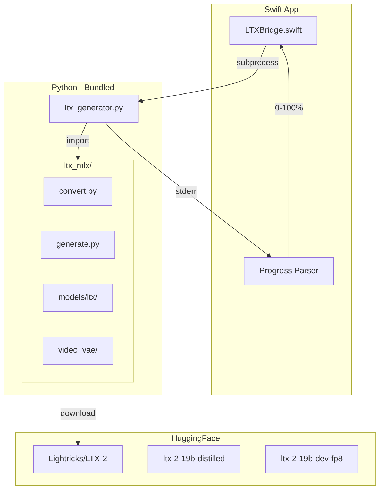

# Bundle MLX-Video for Native LTX-2 Generation

## Goal

Copy mlx-video source code into our project so users only need `mlx`, `numpy`, `safetensors`, `huggingface_hub`, `opencv-python`, and `Pillow` - no `pip install git+...` required. This allows using smaller model variants (fp8 ~8GB vs bf16 ~90GB).

## Architecture



## Files to Copy from mlx-video

From [github.com/Blaizzy/mlx-video](https://github.com/Blaizzy/mlx-video) (MIT License):

```
mlx_video/
├── __init__.py
├── convert.py              # Weight sanitization
├── generate.py             # Main generation (modify for progress)
├── utils.py                # Helper functions
├── conditioning/           # I2V conditioning
│   ├── __init__.py
│   └── latent.py
└── models/ltx/
    ├── __init__.py
    ├── config.py           # Model configs
    ├── ltx.py              # Main transformer (21KB)
    ├── transformer.py      # Transformer blocks
    ├── attention.py        # Multi-head attention
    ├── rope.py             # Rotary embeddings
    ├── adaln.py            # Adaptive LayerNorm
    ├── feed_forward.py     # FF layers
    ├── text_encoder.py     # Text encoder (simplify - remove mlx-vlm)
    ├── upsampler.py        # Latent upsampler
    └── video_vae/
        ├── __init__.py
        ├── decoder.py
        ├── encoder.py
        ├── convolution.py
        ├── resnet.py
        ├── sampling.py
        ├── tiling.py
        ├── ops.py
        └── video_vae.py
```

**Skip:** `audio_vae/`, `generate_av.py`, `vocoder.py` (audio not needed)

## Key Modifications

### 1. Progress Output for Swift Parsing

Modify `generate.py` denoising loop to output stage-aware progress:

```python
# Before denoising loop
print(f"STAGE:{stage_num}:{total_stages}:{total_steps}", file=sys.stderr, flush=True)

# Inside tqdm loop (replace or supplement)
print(f"STEP:{current_step}:{total_steps}", file=sys.stderr, flush=True)
```

### 2. Swift Progress Parsing Update

Update [LTXBridge.swift](LTXVideoGenerator/Sources/Services/LTXBridge.swift) stderr handler:

```swift
// Track current stage
var currentStage = 1
var totalStages = 2

if stderr.contains("STAGE:") {
    // Parse "STAGE:1:2:8" -> stage 1 of 2, 8 steps
    // Map stage 1 to 0-50%, stage 2 to 50-100%
}
if stderr.contains("STEP:") {
    // Parse "STEP:3:8" 
    // Calculate: baseProgress + (step/total * stageRange)
}
```

### 3. Simplify Text Encoder

The original uses `mlx-vlm` for Gemma text encoding. Simplify to use basic tokenizer:

- Remove `mlx-vlm` dependency
- Use `transformers` tokenizer directly for T5/CLIP encoding
- Skip "prompt enhancement" feature (optional Gemma rewriting)

### 4. Model Variant Support

Update [PreferencesView.swift](LTXVideoGenerator/Sources/Views/PreferencesView.swift) `LTXModelVariant`:

```swift
enum LTXModelVariant {
    case distilled      // ltx-2-19b-distilled (~45GB)
    case distilledFP8   // ltx-2-19b-distilled-fp8 (~12GB)
    case dev            // ltx-2-19b-dev (~45GB)
    case devFP8         // ltx-2-19b-dev-fp8 (~12GB)
    
    var modelRepo: String { "Lightricks/LTX-2" }
    var subfolder: String { /* variant name */ }
}
```

## Python Dependencies

Update [requirements.txt](LTXVideoGenerator/requirements.txt):

```
mlx>=0.22.0
numpy
safetensors
huggingface_hub
transformers
opencv-python>=4.12.0
Pillow>=10.3.0
tqdm
```

No git installs required.

## Validation Updates

Update [PythonEnvironment.swift](LTXVideoGenerator/Sources/PythonEnvironment.swift) to check for:

- `mlx` (core)
- `numpy`
- `safetensors`
- `huggingface_hub`
- `cv2` (opencv)
- `PIL`

## File Structure After Implementation

```
LTXVideoGenerator/
├── Resources/
│   ├── ltx_generator.py      # Entry point (updated)
│   └── ltx_mlx/              # Bundled mlx-video code
│       ├── __init__.py
│       ├── convert.py
│       ├── generate.py       # Modified for progress
│       ├── utils.py
│       ├── conditioning/
│       └── models/ltx/
└── Sources/
    ├── Services/
    │   └── LTXBridge.swift   # Updated progress parsing
    └── Views/
        └── PreferencesView.swift  # Model variants
```

## Risk Mitigation

- **MIT License**: mlx-video is MIT licensed, free to copy/modify
- **Upstream changes**: We own the copy, can selectively merge updates
- **Model compatibility**: Uses official Lightricks/LTX-2 weights directly