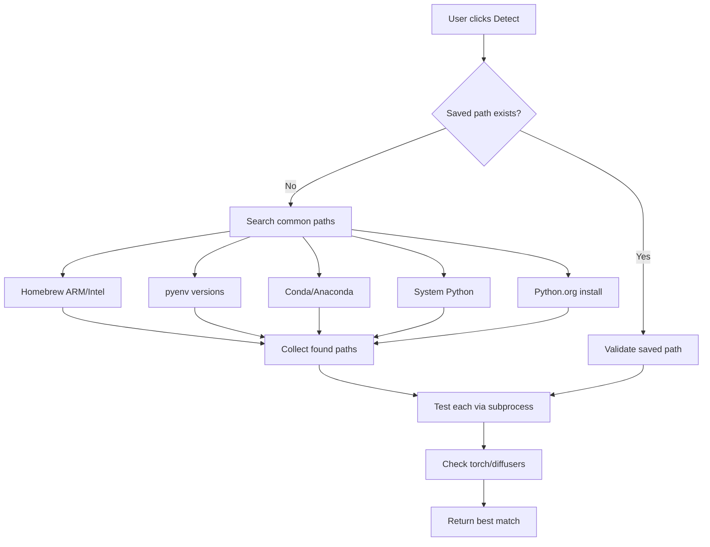
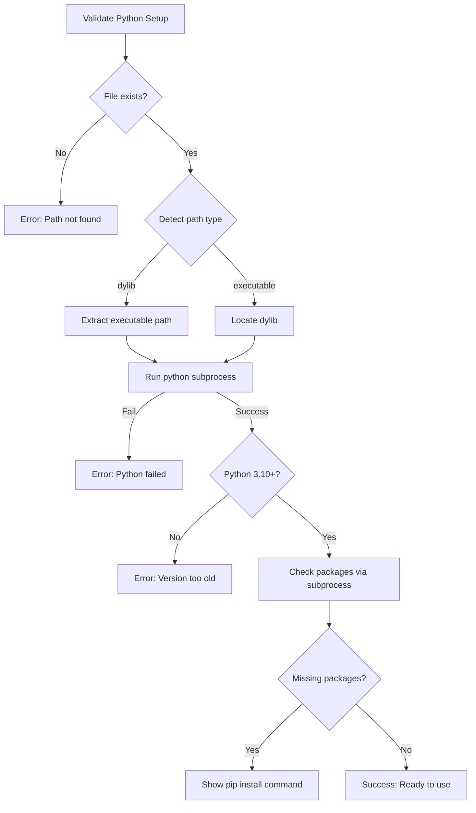

# Fix Python Path Detection and Validation Crashes

## Problem Analysis

The crash occurs because PythonKit's `Python.import()` calls `fatalError` internally when Python isn't properly configured, which bypasses Swift's `do/catch` error handling. The crash trace shows `swift_unexpectedError` being triggered in an async context.

**Key issues in current implementation:**

1. [PythonEnvironment.swift](LTXVideoGenerator/Sources/PythonEnvironment.swift) - Line 69-91: `validatePythonSetup()` uses `try Python.import("sys")` which can fatal crash before error handling
2. Hardcoded path `/Users/jc/.pyenv/versions/3.12.11/lib/libpython3.12.dylib` (line 52) doesn't exist on user machines
3. Limited auto-detection paths (only 4-6 locations checked)
4. Confusing UX: help text mentions dylib but some users try python executables

## Solution

### 1. Add Subprocess-Based Pre-Validation

Before calling any PythonKit functions, validate Python using a subprocess call which cannot crash the app:

```swift
// New method in PythonEnvironment.swift
func validateWithSubprocess(pythonPath: String) async -> (success: Bool, message: String, details: PythonDetails?) {
    // 1. Check file exists
    // 2. Determine if it's dylib or executable, convert as needed
    // 3. Run `python -c "import sys; print(sys.version)"` via Process
    // 4. Return validation result safely
}
```

### 2. Improve Path Detection

Expand [PythonEnvironment.swift](LTXVideoGenerator/Sources/PythonEnvironment.swift) `findPythonPath()` to check more common locations:

- Homebrew (Intel and Apple Silicon)
- pyenv installations
- Conda/Anaconda
- Official Python.org installations
- System Python
- Custom virtualenvs in home directory

### 3. Support Both Path Types

Accept both:

- **dylib paths**: `/opt/homebrew/opt/python@3.11/.../libpython3.11.dylib`
- **executable paths**: `/opt/homebrew/bin/python3`, `~/myenv/bin/python3`

Auto-detect type and convert between them as needed for PythonKit vs subprocess execution.

### 4. Update PreferencesView Validation

In [PreferencesView.swift](LTXVideoGenerator/Sources/Views/PreferencesView.swift):

- Use subprocess validation first (safe, won't crash)
- Only call PythonKit after subprocess confirms Python works
- Show clearer status messages during validation
- Add path type indicator (dylib vs executable)

### 5. Graceful App Startup

In [LTXVideoGeneratorApp.swift](LTXVideoGenerator/Sources/LTXVideoGeneratorApp.swift):

- Don't call `PythonEnvironment.shared.configure()` during init
- Defer Python initialization until actually needed
- Add `isPythonSafelyConfigured` check that uses subprocess validation

## Files to Modify

- **[PythonEnvironment.swift](LTXVideoGenerator/Sources/PythonEnvironment.swift)**: Complete rewrite of validation logic
- **[PreferencesView.swift](LTXVideoGenerator/Sources/Views/PreferencesView.swift)**: Update `detectPython()` and `validatePython()`
- **[LTXVideoGeneratorApp.swift](LTXVideoGenerator/Sources/LTXVideoGeneratorApp.swift)**: Remove eager Python init
- **[LTXBridge.swift](LTXVideoGenerator/Sources/Services/LTXBridge.swift)**: Minor updates to path handling

## Python Path Discovery Flow



## Validation Flow

