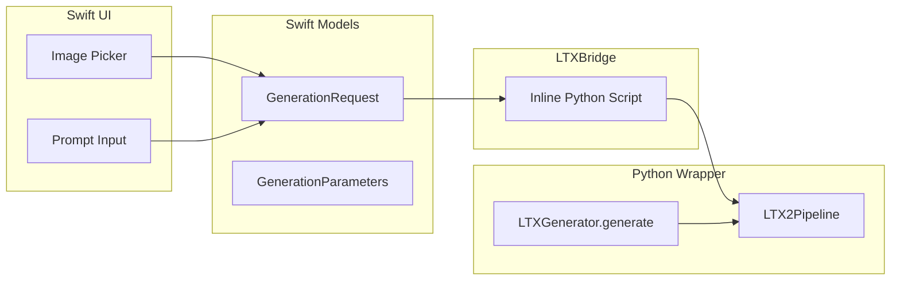

# Image-to-Video Feature for LTX-2

## Overview

Add the ability to use a source image as the first frame for video generation. This is a native LTX-2 capability - pass an `image` parameter to the pipeline and it conditions the video on that image.

## Architecture



## Changes

### 1. Python Wrapper - [ltx_generator.py](LTXVideoGenerator/Resources/ltx_generator.py)

- Add `source_image_path: str | None = None` parameter to `generate()`
- Load image with PIL if provided: `Image.open(source_image_path)`
- Pass to pipeline: `pipe(..., image=source_image)`
- Add `--image` CLI argument
- Add `Pillow` to requirements
```python
def generate(self, prompt, output_path, source_image_path=None, ...):
    image = None
    if source_image_path:
        from PIL import Image
        image = Image.open(source_image_path)
    
    video, audio = self.pipe(
        prompt=prompt,
        image=image,  # NEW: enables image-to-video
        ...
    )
```


### 2. Swift Models - [GenerationRequest.swift](LTXVideoGenerator/Sources/Models/GenerationRequest.swift)

- Add `sourceImagePath: String?` to `GenerationRequest`
- Update initializer to accept optional image path
```swift
struct GenerationRequest: ... {
    let sourceImagePath: String?  // NEW
    
    init(..., sourceImagePath: String? = nil, ...) {
        self.sourceImagePath = sourceImagePath
    }
}
```


### 3. Swift UI - [PromptInputView.swift](LTXVideoGenerator/Sources/Views/PromptInputView.swift)

- Add `@State private var sourceImagePath: String?` 
- Add image picker section with:
  - "Add Source Image" button (shows file picker)
  - Thumbnail preview when image selected
  - Clear button to remove image
- Pass `sourceImagePath` to `GenerationRequest`

### 4. Swift Bridge - [LTXBridge.swift](LTXVideoGenerator/Sources/Services/LTXBridge.swift)

- Accept `sourceImagePath` in `generate()` function
- Update inline Python script to:
  - Load image with PIL if path provided
  - Pass to pipeline's `image` parameter
```python
# In inline script
source_image_path = "\(escapedImagePath)"
image = None
if source_image_path:
    from PIL import Image
    image = Image.open(source_image_path)

video, audio = pipe(
    ...,
    image=image,
)
```


### 5. Requirements - [requirements.txt](LTXVideoGenerator/requirements.txt)

- Add `Pillow>=10.0.0` for image loading

## UI Design

The image picker will be a collapsible section in PromptInputView:

```
[Image to Video (optional)]  ▼
┌─────────────────────────────────┐
│  📷 Select Source Image...      │
│  ─────────────────────────────  │
│  [thumbnail]  bob_dylan.jpg     │
│               512x768           │
│               [× Clear]         │
└─────────────────────────────────┘
```

When an image is selected, the prompt describes the motion/action to apply to that image.