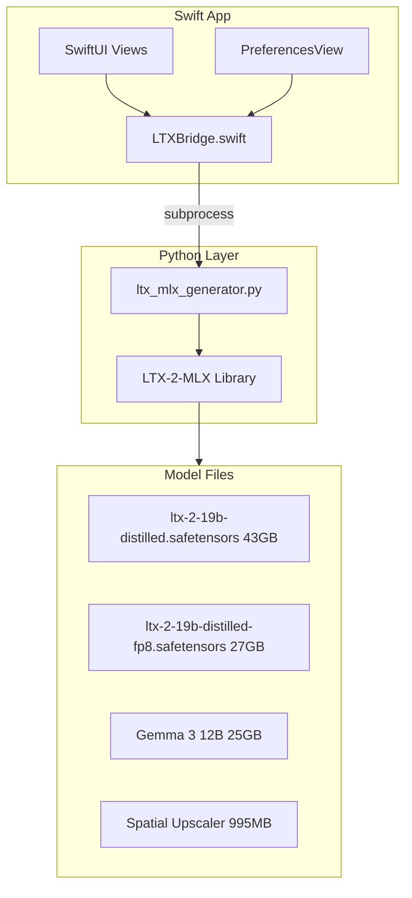

# Migrate LTX Video Generator to MLX

## Current Problem

The current implementation uses PyTorch/diffusers with MPS, which requires patching diffusers source files to fix float64 errors. Model variant loading via `subfolder` is broken. Generation is slow due to non-native implementation.

## Solution

Replace with [LTX-2-MLX](https://github.com/Acelogic/LTX-2-MLX) - a native Apple Silicon implementation that:

- Runs natively on MLX (no MPS patches needed)
- Has better memory management with FP16
- Provides multiple pipeline types (distilled, one-stage, two-stage)
- Is purpose-built for Apple Silicon

## Architecture



## Model Options (User-Selectable)

| Model | Size | Speed | Memory | Use Case |

|-------|------|-------|--------|----------|

| Distilled FP16 | 43GB | Fast (8 steps) | ~18GB | Default, best balance |

| Distilled FP8 | 27GB | Fast (8 steps) | ~14GB | Low memory systems |

| Full FP16 | 43GB | Slow (25-40 steps) | ~24GB | Maximum quality |

## Pipeline Options

| Pipeline | Steps | CFG | Resolution | Notes |

|----------|-------|-----|------------|-------|

| `distilled` | 8 | 1.0 | Up to 768x512 | Fastest, no CFG |

| `one-stage` | 15-25 | 3-5 | Up to 768x512 | Quality with CFG |

| `two-stage` | 15 | 5.0 | Up to 1024x768 | Uses spatial upscaler |

## Files to Modify

### 1. Remove MPS Patch Code

- [PythonEnvironment.swift](LTXVideoGenerator/Sources/PythonEnvironment.swift): Remove `patchDiffusersForMPS()` function and related validation logic (lines ~250-330, ~595-700)
- [PreferencesView.swift](LTXVideoGenerator/Sources/Views/PreferencesView.swift): Remove any MPS patch UI references

### 2. Update Model Variants

- [PreferencesView.swift](LTXVideoGenerator/Sources/Views/PreferencesView.swift): Update `LTXModelVariant` enum:
```swift
enum LTXModelVariant: String, CaseIterable, Identifiable {
    case distilled = "distilled"
    case distilledFP8 = "distilled_fp8"
    case full = "full"
    
    var displayName: String {
        switch self {
        case .distilled: return "LTX-2 Distilled (Fast)"
        case .distilledFP8: return "LTX-2 Distilled FP8 (Low Memory)"
        case .full: return "LTX-2 Full (Quality)"
        }
    }
    
    var weightsFile: String {
        switch self {
        case .distilled: return "ltx-2-19b-distilled.safetensors"
        case .distilledFP8: return "ltx-2-19b-distilled-fp8.safetensors"
        case .full: return "ltx-2-19b-dev.safetensors"
        }
    }
    
    var recommendedSteps: Int {
        switch self {
        case .distilled, .distilledFP8: return 8
        case .full: return 25
        }
    }
}
```


### 3. Replace Python Generator

- [ltx_generator.py](LTXVideoGenerator/Resources/ltx_generator.py): Complete rewrite to use LTX-2-MLX:
```python
#!/usr/bin/env python3
"""LTX Video Generator using MLX for Apple Silicon."""

import sys
sys.path.insert(0, "path/to/LTX-2-MLX")

from LTX_2_MLX.pipelines import TwoStagePipeline, OneStagePipeline
from LTX_2_MLX.model.text_encoder import encode_with_gemma
# ... MLX-based implementation
```


### 4. Update LTXBridge.swift

- [LTXBridge.swift](LTXVideoGenerator/Sources/Services/LTXBridge.swift): 
  - Replace inline diffusers Python script with MLX-based script
  - Remove `device_map`, `torch.float16` references
  - Update progress parsing for MLX output format
  - Handle new model/pipeline parameters

### 5. Update Dependencies

- [requirements.txt](LTXVideoGenerator/requirements.txt): Replace with MLX dependencies:
```
mlx>=0.20.0
numpy>=1.24.0
pillow>=10.0.0
safetensors>=0.4.0
tqdm>=4.65.0
einops>=0.7.0
transformers>=4.57.3
sentencepiece>=0.2.1
```


### 6. Update Validation

- [PythonEnvironment.swift](LTXVideoGenerator/Sources/PythonEnvironment.swift): 
  - Check for MLX instead of diffusers/torch
  - Remove MPS patch checking
  - Add Gemma model path validation

### 7. Add Model Path Configuration

- [PreferencesView.swift](LTXVideoGenerator/Sources/Views/PreferencesView.swift):
  - Add "Models Directory" path selector
  - Show which models are downloaded
  - Add download buttons for missing models

## Testing Checklist

- Build compiles without errors
- Python linting passes (black)
- Swift linting passes
- Model loading works
- Text-to-video generation works
- Progress reporting works
- Different model variants work
- Low memory mode works

## Version Bump

- Update to v2.0.0 (major version for breaking change)
- Update CHANGELOG.md
- Tag release after testing